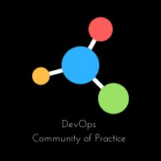

# Canada DevOps Community of Practice

Welcome to Canada's leading network for DevOps and AI innovation.  
Accelerate learning, foster collaboration, and drive transformation in software delivery and platform engineering.

---

## About Us

Canada DevOps Community of Practice is a movement connecting technologists, developers, engineers, and builders across Canada.

We host hackathons, meetups, and open-source projects—shaping the future of DevOps and Generative AI.

---

## Hackathon Highlights

**Previous Winner:**  
Ottawa Hackathon (June 2, 2025):  
[AICommunityofPractice_Observability](https://github.com/CanadaDevOpsCommunity2025/AICommunityofPractice_Observability)

**Upcoming Hackathon:**  
Toronto, November 3, 2025  
[Register here](https://lnkd.in/gTC24_5P)

---

[About Us](about.md) | [Events](events.md) | [Community](community.md) | [Sponsors](sponsors.md) | [Contact](contact.md)
